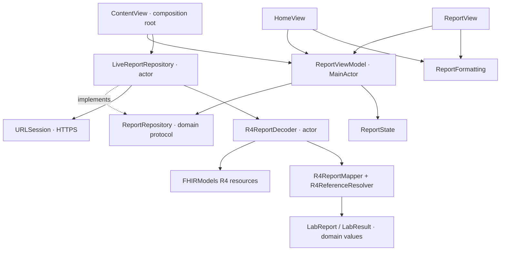

# Architecture

## Responsibilities and dependencies

The dependency direction is toward the domain. The composition root supplies concrete implementations.

Text equivalent: view action → shared view model → repository contract → HTTP repository → decoder/mapper → domain outcome → published state → both views.

## Design patterns

| Pattern | Application |
| --- | --- |
| MVVM | SwiftUI renders ReportState; ReportViewModel controls request lifecycle. |
| Repository | Networking and FHIR details are hidden from presentation. |
| Constructor injection | Tests substitute repositories and URLSession without a service locator. |
| Boundary mapping | FHIR resources become domain values before reaching the UI. |
| Explicit state | Initial failures and refresh failures are represented separately. |

A separate Home view model would duplicate report state. A use-case object would currently forward a single repository call without adding policy. Either can be introduced when independent screen state or additional operations justify it.

## Request lifecycle

1. ContentView creates one repository and one StateObject view model.
2. Its task requests the report independently of the splash.
3. The view model prevents overlapping requests across both tabs.
4. The repository validates the transport response and delegates decoding.
5. The decoder reads the collection envelope with FHIR-aware decoding and maps relevant R4 resources.
6. The view model publishes a domain outcome or a user-facing failure category.

The repository and decoder are actors. The MainActor view model publishes UI state; actor boundaries pass Sendable domain values rather than FHIR resources.

## State transitions

| Starting state | Event | Result |
| --- | --- | --- |
| Idle | Load | Loading |
| Loading | Success | Loaded report or no-report outcome |
| Loading | Failure | Failed, with retry |
| Loading | Cancellation | Previous state restored |
| Loaded | Refresh | Existing outcome retained, refresh loading |
| Refresh loading | Success | New outcome, updated status |
| Refresh loading | Failure | Existing outcome, refresh failure message |
| Refresh loading | Cancellation | Previous loaded state restored |
| Request in flight | Another load/refresh | Ignored |

Cancellation is not displayed as an invalid report or outage. Retaining the prior response avoids removing useful content when a later request fails.

## Data boundary

The mapper preserves reference order and unavailable rows. It does not calculate clinical interpretations, convert units, or infer values from narrative text.

Resolution stays inside the supplied Bundle. Relative references use a server base where available; full URLs and URNs match exactly. Contained fragments are resource-local: equal fragment text in separate resources does not establish a shared subject.

The domain retains unavailable reasons and typed interpretations. Formatting supplies fallback labels and display strings; colors and layout remain presentation concerns.
